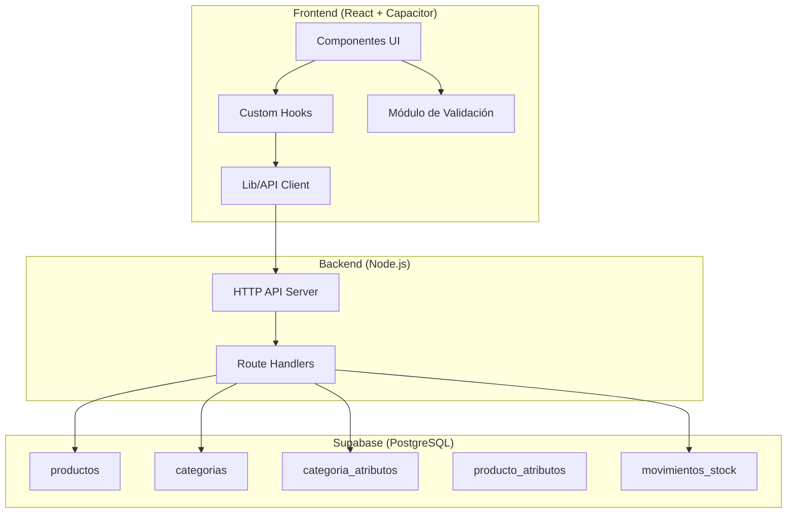
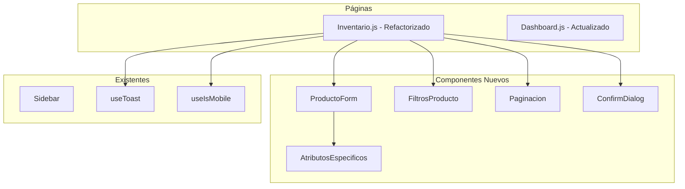
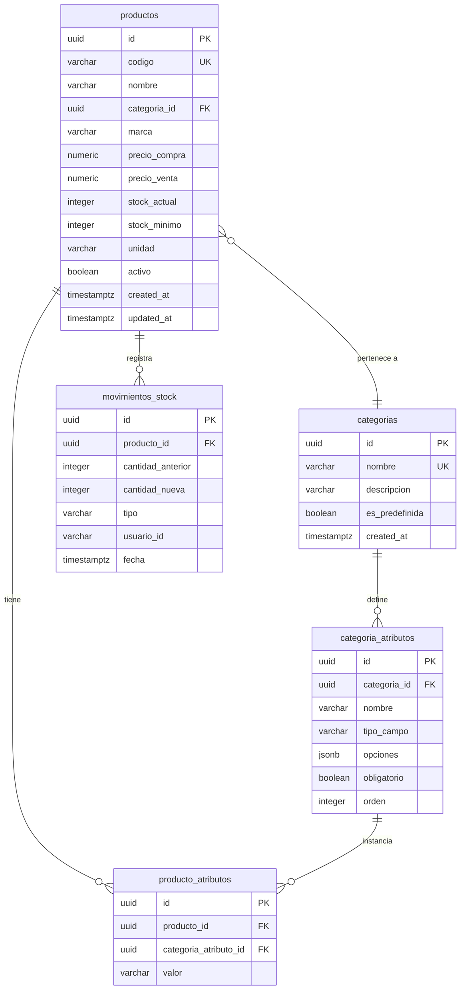

# Documento de Diseño: Hardware Store Inventory

## Overview

Este diseño describe la transformación del sistema de inventario existente (originalmente para charcutería/lácteos) hacia un sistema especializado para ferretería. El cambio principal implica:

1. **Categorías ferreteras** con atributos específicos por categoría (color, dimensiones, peso, tipo, acabado, presentación)
2. **Unidades de medida** propias del ramo ferretero (galón, pliego, metro², etc.)
3. **Validaciones de negocio** específicas (precio venta ≥ precio compra, código único, rangos numéricos)
4. **Gestión de stock** con alertas de bajo inventario y registro de historial de cambios
5. **Búsqueda y filtrado** avanzado por texto, categoría y marca
6. **Visualización adaptativa** (tabla en desktop, tarjetas en móvil) con paginación
7. **Soft-delete** (desactivación/reactivación) de productos

La arquitectura se mantiene sobre el stack existente: React (frontend), Node.js HTTP server (backend), Supabase (PostgreSQL + REST API), y Capacitor (móvil).

## Architecture

### Diagrama de Arquitectura General



### Decisiones Arquitectónicas

| Decisión | Justificación |
|----------|---------------|
| Atributos específicos en tablas separadas (EAV) | Permite agregar categorías y atributos sin modificar el esquema. Más flexible que columnas fijas en `productos`. |
| Validación en dos capas (frontend + DB constraints) | Frontend da feedback inmediato al usuario; constraints en DB garantizan integridad ante cualquier cliente. |
| Paginación server-side con `limit`/`offset` | El inventario puede crecer a miles de productos. Paginar en servidor evita cargar todo en memoria del cliente. |
| Soft-delete con campo `activo` | Preserva historial de movimientos y ventas asociadas. Permite reactivación sin pérdida de datos. |
| Unidades de medida como constante en frontend | Lista fija y pequeña. No requiere tabla en BD. Se mapea la unidad por defecto según categoría. |

## Components and Interfaces

### Componentes Frontend



### Interfaces de Componentes

#### ProductoForm

```javascript
// Props
{
  producto: Object | null,    // null = crear nuevo, Object = editar
  categorias: Array,          // Lista de categorías disponibles
  productosExistentes: Array, // Para validar código duplicado
  onGuardar: Function,        // async (payload) => void
  onCancelar: Function,       // () => void
}
```

#### AtributosEspecificos

```javascript
// Props
{
  categoriaId: String,                // ID de la categoría seleccionada
  atributosConfig: Array,             // Configuración de atributos de la categoría
  valores: Object,                    // Valores actuales { color: "Blanco", tipo: "vinilo" }
  onChange: Function,                  // (nuevosValores) => void
  errores: Object,                    // { tipo: "Campo obligatorio" }
}
```

#### FiltrosProducto

```javascript
// Props
{
  busqueda: String,
  onBusquedaChange: Function,
  categoriaSeleccionada: String,      // '' = Todas
  onCategoriaChange: Function,
  marcaSeleccionada: String,          // '' = Todas
  onMarcaChange: Function,
  categorias: Array,
  marcas: Array,                      // Lista única de marcas existentes
}
```

#### Paginacion

```javascript
// Props
{
  paginaActual: Number,               // 1-indexed
  totalPaginas: Number,
  onCambiarPagina: Function,          // (numeroPagina) => void
}
```

### Funciones de Validación (Módulo puro)

```javascript
// frontend/src/lib/validation.js

/**
 * Valida un formulario de producto completo.
 * @param {Object} form - Datos del formulario
 * @param {Array} productosExistentes - Productos ya registrados (para código duplicado)
 * @param {Array} atributosConfig - Configuración de atributos de la categoría
 * @param {String|null} editandoId - ID del producto en edición (null si es nuevo)
 * @returns {{ valido: boolean, errores: Object }}
 */
function validarProducto(form, productosExistentes, atributosConfig, editandoId) { }

/**
 * Valida un formulario de categoría.
 * @param {Object} form - { nombre, descripcion }
 * @param {Array} categoriasExistentes - Categorías ya registradas
 * @param {String|null} editandoId - ID de la categoría en edición
 * @returns {{ valido: boolean, errores: Object }}
 */
function validarCategoria(form, categoriasExistentes, editandoId) { }

/**
 * Obtiene la unidad de medida por defecto para una categoría.
 * @param {String} nombreCategoria
 * @returns {String}
 */
function obtenerUnidadPorDefecto(nombreCategoria) { }

/**
 * Determina si un producto tiene stock bajo.
 * @param {Object} producto - { stock_actual, stock_minimo }
 * @returns {boolean}
 */
function esStockBajo(producto) { }

/**
 * Valida un valor de stock.
 * @param {any} valor
 * @returns {{ valido: boolean, error: String|null }}
 */
function validarStock(valor) { }
```

### Funciones de Filtrado y Paginación

```javascript
// frontend/src/lib/filters.js

/**
 * Filtra productos según criterios combinados (AND).
 * @param {Array} productos - Lista completa de productos
 * @param {{ busqueda: String, categoriaId: String, marca: String }} filtros
 * @returns {Array} Productos que cumplen todos los criterios
 */
function filtrarProductos(productos, filtros) { }

/**
 * Pagina una lista de elementos.
 * @param {Array} items - Lista completa
 * @param {Number} pagina - Página actual (1-indexed)
 * @param {Number} porPagina - Elementos por página (default 20)
 * @returns {{ items: Array, totalPaginas: Number, paginaActual: Number }}
 */
function paginar(items, pagina, porPagina = 20) { }

/**
 * Formatea un número como precio en COP.
 * @param {Number} valor
 * @returns {String} Ej: "$15.000"
 */
function formatearPrecioCOP(valor) { }
```

## Data Models

### Diagrama Entidad-Relación



### Esquema de Tablas

#### productos (modificación de tabla existente)

| Campo | Tipo | Restricciones | Descripción |
|-------|------|---------------|-------------|
| id | uuid | PK, default gen_random_uuid() | Identificador único |
| codigo | varchar(20) | NOT NULL, UNIQUE | Código alfanumérico |
| nombre | varchar(100) | NOT NULL | Nombre del producto |
| categoria_id | uuid | FK → categorias.id, NOT NULL | Categoría |
| marca | varchar(50) | NULL | Marca comercial |
| precio_compra | numeric(12,0) | NOT NULL, CHECK (1..999999999) | Precio compra COP |
| precio_venta | numeric(12,0) | NOT NULL, CHECK (1..999999999), CHECK (>= precio_compra) | Precio venta COP |
| stock_actual | integer | NOT NULL, DEFAULT 0, CHECK (0..99999) | Stock actual |
| stock_minimo | integer | NOT NULL, DEFAULT 0, CHECK (0..99999) | Stock mínimo alerta |
| unidad | varchar(20) | NOT NULL, DEFAULT 'unidad' | Unidad de medida |
| activo | boolean | NOT NULL, DEFAULT true | Soft-delete flag |
| created_at | timestamptz | DEFAULT now() | Fecha creación |
| updated_at | timestamptz | DEFAULT now() | Última actualización |

#### categorias (reemplazo de tabla existente)

| Campo | Tipo | Restricciones | Descripción |
|-------|------|---------------|-------------|
| id | uuid | PK | Identificador |
| nombre | varchar(50) | NOT NULL, UNIQUE | Nombre categoría |
| descripcion | varchar(200) | NULL | Descripción opcional |
| es_predefinida | boolean | DEFAULT false | Si es del sistema |
| created_at | timestamptz | DEFAULT now() | Fecha creación |

#### categoria_atributos (nueva tabla)

| Campo | Tipo | Restricciones | Descripción |
|-------|------|---------------|-------------|
| id | uuid | PK | Identificador |
| categoria_id | uuid | FK → categorias.id, NOT NULL | Categoría padre |
| nombre | varchar(50) | NOT NULL | Nombre atributo |
| tipo_campo | varchar(20) | NOT NULL | 'texto', 'numero', 'seleccion' |
| opciones | jsonb | NULL | Opciones para selección |
| obligatorio | boolean | DEFAULT false | Si es requerido |
| orden | integer | DEFAULT 0 | Orden visualización |

**Constraint:** máximo 10 atributos por categoría (enforced en aplicación).

#### producto_atributos (nueva tabla)

| Campo | Tipo | Restricciones | Descripción |
|-------|------|---------------|-------------|
| id | uuid | PK | Identificador |
| producto_id | uuid | FK → productos.id, NOT NULL | Producto |
| categoria_atributo_id | uuid | FK → categoria_atributos.id, NOT NULL | Definición atributo |
| valor | varchar(200) | NOT NULL | Valor del atributo |

**Constraint:** UNIQUE(producto_id, categoria_atributo_id)

#### movimientos_stock (nueva tabla)

| Campo | Tipo | Restricciones | Descripción |
|-------|------|---------------|-------------|
| id | uuid | PK | Identificador |
| producto_id | uuid | FK → productos.id, NOT NULL | Producto afectado |
| cantidad_anterior | integer | NOT NULL | Stock antes del cambio |
| cantidad_nueva | integer | NOT NULL | Stock después del cambio |
| tipo | varchar(20) | NOT NULL | 'ajuste_manual' |
| usuario_id | varchar(100) | NULL | Identificador usuario |
| fecha | timestamptz | DEFAULT now() | Fecha y hora |

### Constantes del Sistema

```javascript
const UNIDADES_FERRETERIA = [
  'unidad', 'galón', 'cuarto', 'litro', 'metro',
  'metro cuadrado', 'pliego', 'rollo', 'bolsa',
  'caja', 'libra', 'kilogramo', 'pie', 'pulgada', 'tubo'
]

const UNIDAD_POR_DEFECTO = {
  'Pinturas': 'galón',
  'Drywall': 'pliego',
  'Estucos': 'kilogramo',
  'Herramientas': 'unidad',
  'Tornillería': 'unidad',
  'Eléctricos': 'metro',
  'Plomería': 'metro',
  'Adhesivos y Sellantes': 'unidad',
  'Abrasivos': 'unidad',
  'Seguridad Industrial': 'unidad',
}

const CATEGORIAS_PREDEFINIDAS = [
  'Pinturas', 'Drywall', 'Estucos', 'Herramientas', 'Tornillería',
  'Eléctricos', 'Plomería', 'Adhesivos y Sellantes', 'Abrasivos', 'Seguridad Industrial'
]
```

## Correctness Properties

*Una propiedad es una característica o comportamiento que debe mantenerse verdadero en todas las ejecuciones válidas de un sistema — esencialmente, una declaración formal sobre lo que el sistema debe hacer. Las propiedades sirven como puente entre especificaciones legibles por humanos y garantías de correctitud verificables por máquina.*

### Property 1: Validación integral de producto

*Para cualquier* payload de producto generado aleatoriamente, la función `validarProducto` SHALL rechazar el producto si algún campo obligatorio está vacío, si el código excede 20 caracteres, si el nombre excede 100 caracteres, si los precios están fuera del rango [1, 999.999.999], si el precio de venta es menor al precio de compra, si el stock está fuera de [0, 99.999], si el código ya existe en productos existentes, si la marca excede 50 caracteres, si un atributo numérico (dimensiones/peso) es ≤ 0, o si un atributo obligatorio de la categoría está vacío. SHALL aceptar el producto si todos los campos cumplen las restricciones.

**Validates: Requirements 1.1, 1.3, 1.4, 1.5, 1.6, 3.5, 3.6, 5.5**

### Property 2: Validación de categoría

*Para cualquier* payload de categoría generado aleatoriamente, la función `validarCategoria` SHALL rechazar si el nombre está vacío o excede 50 caracteres, si la descripción excede 200 caracteres, si el nombre ya existe (case-insensitive) en categorías existentes, o si se intenta configurar más de 10 atributos. SHALL aceptar si todos los campos cumplen las restricciones.

**Validates: Requirements 2.2, 2.3, 2.5**

### Property 3: Mapeo de unidad de medida por defecto

*Para cualquier* nombre de categoría, la función `obtenerUnidadPorDefecto` SHALL retornar la unidad mapeada si la categoría está en el mapeo predefinido (Pinturas→galón, Drywall→pliego, Estucos→kilogramo, etc.), o SHALL retornar 'unidad' si la categoría no está en el mapeo.

**Validates: Requirements 1.2, 4.2, 4.3**

### Property 4: Invariante de alerta de stock

*Para cualquier* producto con valores de stock_actual y stock_minimo, la función `esStockBajo` SHALL retornar true cuando stock_actual ≤ stock_minimo, y false cuando stock_actual > stock_minimo. El conteo de productos en alerta en cualquier lista SHALL ser igual al número de productos que cumplen esa condición.

**Validates: Requirements 5.1, 5.2, 5.3**

### Property 5: Filtrado combinado de productos (intersección AND)

*Para cualquier* lista de productos activos y cualquier combinación de filtros (texto de búsqueda, categoría, marca), la función `filtrarProductos` SHALL retornar exactamente los productos que cumplen TODOS los criterios simultáneamente: nombre/código/marca contiene el texto (case-insensitive), categoría coincide (o todas si está vacío), marca coincide (o todas si está vacío), y activo=true. Con filtros vacíos, SHALL retornar todos los productos activos.

**Validates: Requirements 6.1, 6.2, 6.3, 6.4, 6.6, 8.2**

### Property 6: Formato de precio COP (round-trip)

*Para cualquier* valor numérico entero no negativo, la función `formatearPrecioCOP` SHALL producir una cadena que comience con "$", use "." como separador de miles, y no contenga decimales. Parsear el string resultante (removiendo "$" y ".") SHALL producir el valor numérico original.

**Validates: Requirements 7.3**

### Property 7: Correctitud de paginación

*Para cualquier* lista de productos de longitud N y tamaño de página 20, la función `paginar` SHALL producir ceil(N/20) páginas, cada una con máximo 20 elementos. La unión de todas las páginas SHALL contener exactamente todos los N productos sin duplicados ni omisiones.

**Validates: Requirements 7.4**

### Property 8: Desactivación y reactivación preservan datos

*Para cualquier* producto, al cambiar el campo `activo` (de true a false o viceversa), todos los demás campos (código, nombre, precios, stock, atributos, marca) SHALL permanecer sin modificación.

**Validates: Requirements 8.1, 8.6**

### Property 9: Protección de eliminación de categoría

*Para cualquier* categoría que tiene al menos un producto asociado (activo o inactivo), la función de eliminación SHALL rechazar la operación. Para categorías sin productos asociados, SHALL permitir la eliminación.

**Validates: Requirements 2.4**

## Error Handling

### Errores de Validación (Frontend)

| Escenario | Mensaje | Comportamiento |
|-----------|---------|----------------|
| Campo obligatorio vacío | "Este campo es obligatorio" | Resaltar campo en rojo, impedir envío |
| Código duplicado | "Ya existe un producto con el código '{código}'" | Resaltar campo código |
| Precio venta < precio compra | "El precio de venta debe ser mayor o igual al precio de compra" | Resaltar ambos campos de precio |
| Valor fuera de rango | "El valor debe estar entre {min} y {max}" | Resaltar campo |
| Texto excede longitud | "Máximo {n} caracteres" | Resaltar campo |
| Atributo numérico ≤ 0 | "El valor debe ser mayor a cero" | Resaltar campo numérico |
| Categoría con productos | "No se puede eliminar: {n} productos asociados" | Impedir eliminación |
| Nombre categoría duplicado | "Ya existe una categoría con este nombre" | Resaltar campo nombre |
| Más de 10 atributos | "Máximo 10 atributos por categoría" | Impedir adición |

### Errores de Red/Servidor

| Escenario | Mensaje | Comportamiento |
|-----------|---------|----------------|
| API no disponible | "No se pudo conectar con el servidor. Intente nuevamente." | Toast error, preservar estado |
| Error al guardar | "Error al guardar: {detalle}" | Toast error, formulario abierto |
| Error al actualizar stock | "No se pudo actualizar el stock." | Toast error, preservar valor anterior |
| Timeout | "La operación tardó demasiado. Verifique su conexión." | Toast error |
| Servidor no configurado (Capacitor) | Pantalla de configuración de servidor | Flujo existente |

### Estrategia de Recuperación

- Los errores de red NO modifican el estado local hasta confirmar éxito del servidor
- Los formularios preservan los datos ingresados ante errores para permitir reintento
- El estado de carga (loading) se muestra durante operaciones asíncronas
- Los toasts de error desaparecen automáticamente después de 5 segundos
- Botón de reintentar cuando falla la carga inicial de datos

## Testing Strategy

### Tests Unitarios (Jest)

Tests de ejemplo y edge cases para:
- Renderizado correcto de componentes (ProductoForm, FiltrosProducto, Paginacion)
- Comportamiento del formulario: abrir, cerrar, llenar campos, cambiar categoría resetea atributos
- Diálogo de confirmación de desactivación (mostrar/cancelar/confirmar)
- Visualización de alertas de stock bajo en tabla y tarjetas
- Formato de precios con valores específicos (0, 1000, 15000, 999999999)
- Cambio automático tabla/tarjetas al redimensionar (useIsMobile hook)
- Manejo de errores de red (mocks de fetch)

### Tests Basados en Propiedades (fast-check)

Librería: **fast-check** (JavaScript property-based testing)

**Configuración:**
- Mínimo 100 iteraciones por test de propiedad
- Cada test referencia su propiedad del documento de diseño
- Formato de tag: **Feature: hardware-store-inventory, Property {número}: {título}**

**Tests implementados:**

1. `validarProducto` — Genera payloads aleatorios, verifica aceptación/rechazo correcto
   - Tag: `Feature: hardware-store-inventory, Property 1: Validación integral de producto`

2. `validarCategoria` — Genera categorías aleatorias, verifica restricciones
   - Tag: `Feature: hardware-store-inventory, Property 2: Validación de categoría`

3. `obtenerUnidadPorDefecto` — Verifica mapeo correcto para todas las categorías
   - Tag: `Feature: hardware-store-inventory, Property 3: Mapeo de unidad de medida por defecto`

4. `esStockBajo` — Genera productos con stocks aleatorios, verifica detección
   - Tag: `Feature: hardware-store-inventory, Property 4: Invariante de alerta de stock`

5. `filtrarProductos` — Genera productos y filtros aleatorios, verifica intersección AND
   - Tag: `Feature: hardware-store-inventory, Property 5: Filtrado combinado de productos`

6. `formatearPrecioCOP` — Genera números aleatorios, verifica formato y round-trip
   - Tag: `Feature: hardware-store-inventory, Property 6: Formato de precio COP`

7. `paginar` — Genera listas de longitud aleatoria, verifica distribución correcta
   - Tag: `Feature: hardware-store-inventory, Property 7: Correctitud de paginación`

8. Desactivación/reactivación — Genera productos, verifica preservación de datos
   - Tag: `Feature: hardware-store-inventory, Property 8: Desactivación y reactivación preservan datos`

9. Eliminación de categoría — Genera categorías con/sin productos, verifica protección
   - Tag: `Feature: hardware-store-inventory, Property 9: Protección de eliminación de categoría`

### Tests de Integración

- Crear producto completo y verificar persistencia en Supabase
- Código duplicado rechazado por BD (constraint UNIQUE)
- Actualizar stock y verificar creación de movimiento
- Desactivar y reactivar producto
- Eliminar categoría con productos asociados (rechazado)

### Estructura de Archivos de Test

```
frontend/src/__tests__/
├── validation.property.test.js    # PBT: Propiedades 1, 2
├── filters.property.test.js       # PBT: Propiedades 4, 5
├── formatting.property.test.js    # PBT: Propiedades 6, 7
├── units.property.test.js         # PBT: Propiedad 3
├── products.property.test.js      # PBT: Propiedades 8, 9
├── components.test.js             # Unit: componentes UI
├── integration/
│   ├── products.integration.test.js
│   └── categories.integration.test.js
```

### Cobertura Esperada

| Tipo | Cantidad | Cobertura |
|------|----------|-----------|
| Property tests | 9 propiedades × 100+ iteraciones | Lógica de negocio, validación, filtrado |
| Unit tests | ~15-20 tests | UI, formato, casos borde, errores |
| Integration tests | ~5-8 tests | Flujos completos con API |
